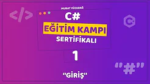
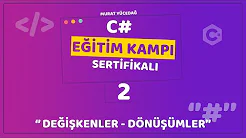
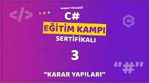
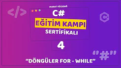
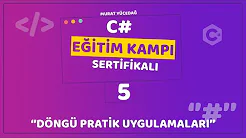
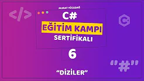
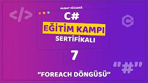
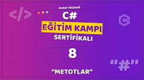
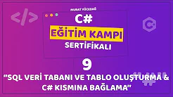
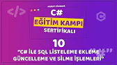

<!DOCTYPE html>
<html lang="tr">
<head>
<body>
    <h1>Murat YÜCEDAĞ ile C# Eğitim Kampı.</h1>
    

        &nbsp;&nbsp;&nbsp;&nbsp;&nbsp;&nbsp;Murat Yücedağ'ın hazırlayıp yayımladığı yazılıma 
        gönül vermiş ve yeni başlayanlar için rehber olabilecek bir etkinlik.
    
  

  

        
        <strong>Proje 1: GİRİŞ</strong> 
  
 
 
     

   
 
        <ul style="font-family: Arial; font-size: 12pt;"> Bu projede; 
            <li>İhtiyaç olan Visual Studio bileşenleri,</li>
            <li>Projenin Oluşturulması,</li>
            <li>Yazdırma Komutları,</li>
            <li>String Değişkenler,</li>
            <li>Int Değişkenler</li>
            <li>Ekstra Kurs Tavsiyeleri</li>
            <li>ve Tavsiye - Yazılım Sektöründe İstikrar konularında bilgi sahibi olduk.</li>
        </ul>
    

    --------------------------------------------  
    

        
        <strong>Proje 2: DEĞİŞKENLER</strong> 
    

    

        <ul style="font-family: Arial; font-size: 12pt;"> Bu projede; 
            <li>Double Değişkenler,</li>
            <li>Char Değişkenler,</li>
            <li>Klavyeden String Değişken Girişleri,</li>
            <li>Klavyeden Int Değişken Girişleri,</li>
            <li>Klavyeden Double Değişken Girişler</li>
            <li>Ekstra Kurs Tavsiyeleri</li>
            <li>Klavyeden Char Değişken Girişler Değişken ve Değişkenlere değer atamalarını öğrendik ve Üniversite derslerdeki beklentiler hakkında montörlük aldık.</li>
        </ul>

--------------------------------------------  

        
        <strong>Proje 3: KARAR YAPILARI</strong> 
  
 
 
     

   

   Bu projede;  if - else, switch - case Karar yapılarını ve break komutunun yapısını inceledik
       

--------------------------------------------  

        
        <strong>Proje 4: DÖNGÜLER</strong> 
  
 
 
     

   

   Bu projede;  for, while döngülerinin yapısını inceledik.
       

--------------------------------------------  

        
        <strong>Proje 5: UYGULAMALAR</strong> 
  
 
 
     

   

   Döngüler ile pratik uygulamalar ve yıldızlarla  şekil yaptık.
       

--------------------------------------------  

        
        <strong>Proje 6: DİZİLER</strong> 
  
 

   

   Bu projede;  Diziler yapısını, Temel dizi örneklerini ve Dizi metodları ile ilgili örnek çalışmalar  yaptık.
       

--------------------------------------------  

        
        <strong>Proje 7: foreach DÖNGÜSÜ</strong> 
  
 
 
     

   

   Bu projede;  foreach döngüsünü öğrendik ve "Örnek Sınav Sistemi Uygulaması" başlıklı bir proje uygulması yaptık.
       

--------------------------------------------  

        
        <strong>Proje 8: METOTLAR</strong> 
  
 
 
     

   
 
        <ul style="font-family: Arial; font-size: 12pt;"> Bu projede; 
            <li>Void Metotlar,</li>
            <li>Geriye Değer Döndürmeyen String Parametreli Metotlar,</li>
            <li>Geriye Değer Döndürmeyen int Parametreli Metotlar,</li>
            <li>Geriye Değer Döndüren String Parametreli Metotlar,</li>
            <li>Geriye Değer Döndüren int Parametreli Metotlar,</li>
            metot çeşitlerini inceledik ve Örnek uygulama yaptık.
           </li>
        </ul>
    

--------------------------------------------  

        
        <strong>Proje 9: C# ile VERİ TABANI BAĞLANTISI</strong> 
  
 
 
     

   

   Bu projede;  SQL Veri tabanı, SQL veri tabanında tablo oluşturma ve oluşturulan veri tabanına C# tarafından ulaşılabilmeyi öğrendik
       

--------------------------------------------  

        
        <strong>Proje 10: C# ile VERİ TABANI CRUD</strong> 
  
 
 
     

   

   Bu projede;  SQL Veri tabanına C# tarafından ulaşarak Create, Read, Update ve Delete komutları ile SQL de bulunan tablolara müdahale etmeyi öğrendik.
       

--------------------------------------------  

</body>
</html>
