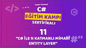
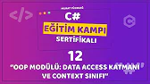
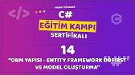
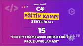
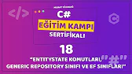
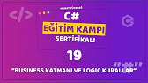

<!DOCTYPE html>
<html lang="tr">
<head>
<body>
    <h1>Murat YÜCEDAĞ ile C# Eğitim Kampı.</h1>
    

        &nbsp;&nbsp;&nbsp;&nbsp;&nbsp;&nbsp;Murat Yücedağ'ın hazırlayıp yayımladığı yazılıma 
        gönül vermiş ve yeni başlayanlar için rehber olabilecek bir etkinlik.
    
  

  

        
        <strong>Proje 1: GİRİŞ</strong> 
  
 
 
     

   
 
        <ul style="font-family: Arial; font-size: 12pt;"> Bu projede; 
            <li>İhtiyaç olan Visual Studio bileşenleri,</li>
            <li>Projenin Oluşturulması,</li>
            <li>Yazdırma Komutları,</li>
            <li>String Değişkenler,</li>
            <li>Int Değişkenler</li>
            <li>Ekstra Kurs Tavsiyeleri</li>
            <li>ve Tavsiye - Yazılım Sektöründe İstikrar konularında bilgi sahibi olduk.</li>
        </ul>
    

    --------------------------------------------  
    

        
        <strong>Proje 2: DEĞİŞKENLER</strong> 
    

    

        <ul style="font-family: Arial; font-size: 12pt;"> Bu projede; 
            <li>Double Değişkenler,</li>
            <li>Char Değişkenler,</li>
            <li>Klavyeden String Değişken Girişleri,</li>
            <li>Klavyeden Int Değişken Girişleri,</li>
            <li>Klavyeden Double Değişken Girişler</li>
            <li>Ekstra Kurs Tavsiyeleri</li>
            <li>Klavyeden Char Değişken Girişler Değişken ve Değişkenlere değer atamalarını öğrendik ve Üniversite derslerdeki beklentiler hakkında montörlük aldık.</li>
        </ul>

--------------------------------------------  

        
        <strong>Proje 3: KARAR YAPILARI</strong> 
  
 
 
     

   

   Bu projede;  if - else, switch - case Karar yapılarını ve break komutunun yapısını inceledik
       

--------------------------------------------  

        
        <strong>Proje 4: DÖNGÜLER</strong> 
  
 
 
     

   

   Bu projede;  for, while döngülerinin yapısını inceledik.
       

--------------------------------------------  

        
        <strong>Proje 5: UYGULAMALAR</strong> 
  
 
 
     

   

   Döngüler ile pratik uygulamalar ve yıldızlarla  şekil yaptık.
       

--------------------------------------------  

        
        <strong>Proje 6: DİZİLER</strong> 
  
 

   

   Bu projede;  Diziler yapısını, Temel dizi örneklerini ve Dizi metodları ile ilgili örnek çalışmalar  yaptık.
       

--------------------------------------------  

        
        <strong>Proje 7: foreach DÖNGÜSÜ</strong> 
  
 
 
     

   

   Bu projede;  foreach döngüsünü öğrendik ve "Örnek Sınav Sistemi Uygulaması" başlıklı bir proje uygulması yaptık.
       

--------------------------------------------  

        
        <strong>Proje 8: METOTLAR</strong> 
  
 
 
     

   
 
        <ul style="font-family: Arial; font-size: 12pt;"> Bu projede; 
            <li>Void Metotlar,</li>
            <li>Geriye Değer Döndürmeyen String Parametreli Metotlar,</li>
            <li>Geriye Değer Döndürmeyen int Parametreli Metotlar,</li>
            <li>Geriye Değer Döndüren String Parametreli Metotlar,</li>
            <li>Geriye Değer Döndüren int Parametreli Metotlar,</li>
            metot çeşitlerini inceledik ve Örnek uygulama yaptık.
           </li>
        </ul>
    

--------------------------------------------  

        
        <strong>Proje 9: C# ile VERİ TABANI BAĞLANTISI</strong> 
  
 
 
     

   

   Bu projede;  SQL Veri tabanı, SQL veri tabanında tablo oluşturma ve oluşturulan veri tabanına C# tarafından ulaşılabilmeyi öğrendik
       

--------------------------------------------  

        
        <strong>Proje 10: C# ile VERİ TABANI CRUD</strong> 
  
 
 
     

   

   Bu projede;  SQL Veri tabanına C# tarafından ulaşarak Create, Read, Update ve Delete komutları ile SQL de bulunan tablolara müdahale etmeyi öğrendik.
       

--------------------------------------------  

        
        <strong>Proje 11: C# Nesne Tabanlı Programa Giriş</strong> 
  
 
 
     

   

   Bu projede;  Katmanları Öğrendik ve Oluşturduk.
       

--------------------------------------------  

        
        <strong>Proje 12: C# SQL Tablosu Oluşturma</strong> 
  
 
 
     

   

   Bu projede;  C# kullanarak SQL tabloları oluşturmay öğrendik.
       

--------------------------------------------  

        
        <strong>Proje 13: C# Sınıfların İlişiklendirilmesi </strong> 
  
 
 
     

   

   Bu projede; C# ile Oluşturulan tabloların biribiriyle ilişkilendirilmesi ve database bağlantıyı öğrendik.
       

--------------------------------------------  

        
        <strong>Proje 14: C#  Orm Yapısı: Entity Framework DbFirst ve Model Oluşturma </strong> 
  
 
 
     

   

   Bu projede; Entity Framework ile Model oluşturmayı öğrendik.
       

--------------------------------------------  

        
        <strong>Proje 15: C#  Entity Framework Metotları ile Proje Uygulaması </strong> 
  
 
 
     

   

   Bu projede; Bir seyahat Acentası projesine başladık Entity Framework ile çalışmaya başladık.
       

--------------------------------------------  

        
        <strong>Proje 16: C#  Entity Framework Metotları ile Proje Uygulaması </strong> 
  
 
 
     

   

   Bu projede; Bir seyahat Acentası projesine devam ettik Lokasyon Tablosu oluşturduk. Lokasyon listeleme, Lokasyon Ekleme, Lokasyon Silme, Lokasyon Update etme metodlarını öğrendik.
       

--------------------------------------------  

        
        <strong>Proje 17: C#  Entity Framework Metotları ile Proje Uygulaması </strong> 

  

 

 C# Eğitimizde Uyguladığımız Entity Framework çalışmalarımızdaki proje uygulamızda yapmış olduğumuz sorgular.
     

    

      

--------------------------------------------  

        
        <strong>Proje 18: C#  EntityState Komutları, GenerikRepository ve Ef sınıfları </strong> 
  
 
 
     

   

   Bu projede; EntityState Komutlarını inceledik , GenerikRepository ve Ef sınıflarını oluşturduk .
       

--------------------------------------------  

        
        <strong>Proje 19: C#  Businiss katmanı ve Logic kurallar </strong> 
  
 
 
     

   

   Bu projede; Service interface ve Manager classlarını tanımladık .
       

--------------------------------------------  

        
        <strong>Proje 20: C#  Dependency Injection </strong> 
  
 
 
     

   

   Bu projede; Dependency Injection kullanarak FrmCatogory adlı form oluşturarak; 
   *** listele 
   *** Sil 
   *** Güncelle 
   *** Id'ye Göre Getir  
   işlemlerini yaptık.
       

--------------------------------------------  

        
        <strong>Proje 21: C#   Entitye Özgü Metot Yazmak</strong> 
  
 
 
     

   

   Bu projede; Ders 20 nin devamı olarak FrmProducts adlı form oluşturduk.
   Bu formda; 
   *** Listele Butonu tıklayarak ve database'deki verileri listeledik. Bu listelemede CatagorName için Entity Özel Metod yazdık.
       

--------------------------------------------  

        
        <strong>Proje 22: C#   Dapper'e Giriş</strong> 
  
 
 
     

   

   Bu projede; CSharpEgitim301 modülünü bitirdik. CSharpEgitim501 modülüne ve Dapper' giriş yaptık. Asenktron modülü inceledik.
  
       

--------------------------------------------  

        
        <strong>Proje 23: C#   Dapper</strong> 
  
 
 
     

   

   Bu projede; Dapper ile Kitaplar Database'nde;  
   * Ürün Listeleme  
   * Ürün Ekleme  
   * Ürün Silme  
   * Ürün Güncelleme 
   ve değişik istatistik sonuçlar için sorgu kodları yazdık.

--------------------------------------------  

        
        <strong>Proje 24: C#  MongoDB </strong> 
  
 
 
    

   

   Bu projede; MongoDB ye giriş yaptık. Form oluşturarak Collection açtık ve Bson Dokument oluşturduk. Örnek veri girişi yaptık.

--------------------------------------------  

        
        <strong>Proje 25: C#  MongoDB kullanımı ikinci bölüm </strong> 
  
 
 
    

   

   Bu projede; MongoDB de;  
   * Ürün Listeleme  
   * Ürün Ekleme  
   * Ürün Silme  
   * Ürün Güncelleme 
   ve değişik istatistik sonuçlar için sorgu kodları yazdık

--------------------------------------------  

        
        <strong>Proje 26: C#  PostgreSQL e giriş </strong> 
  
 
 
    

   

   Bu projede; PostgreSQL e giriş yaptık. pgAdmin4 arayüzü kullanarak Customer tablosu oluşturduk.

--------------------------------------------  

        
        <strong>Proje 27: C#  PostgreSQL </strong> 
  
 
 
    

   

   Bu projede;  Bu projede; PostgreSQL de;  
   Employees tablosu ve Departments tabloları oluşturarak iki tabloyu birbiriyle ilişkilendirdik. 
   * Ürün Listeleme  
   * Ürün Ekleme    
   işlemleri yaptık.     

--------------------------------------------  

        
        <strong>Proje 28: C#  FinancialCrm </strong> 
  
 
 
    

   

   Bu projede;  Bu projede; Final Projesi FinalCrm'ye başladık  
   Database ve tabloları, 
   WindowsForm oluşturduk.   

--------------------------------------------  

        
        <strong>Proje 27: C# FinancialCrm  </strong> 
  
 
 
    

   

   Bu projede;  Bir ders önce başladığımız FinancialCrm projesine devam ettik.    

--------------------------------------------  

        
        <strong>Proje 30: C# FinancialCrm  </strong> 
  
 
 
    

   

   ve Final.... 
   28. derste başladığımız Final projemiz FinancialCrm'yi tamamladık.    

--------------------------------------------  

</body>
</html>
